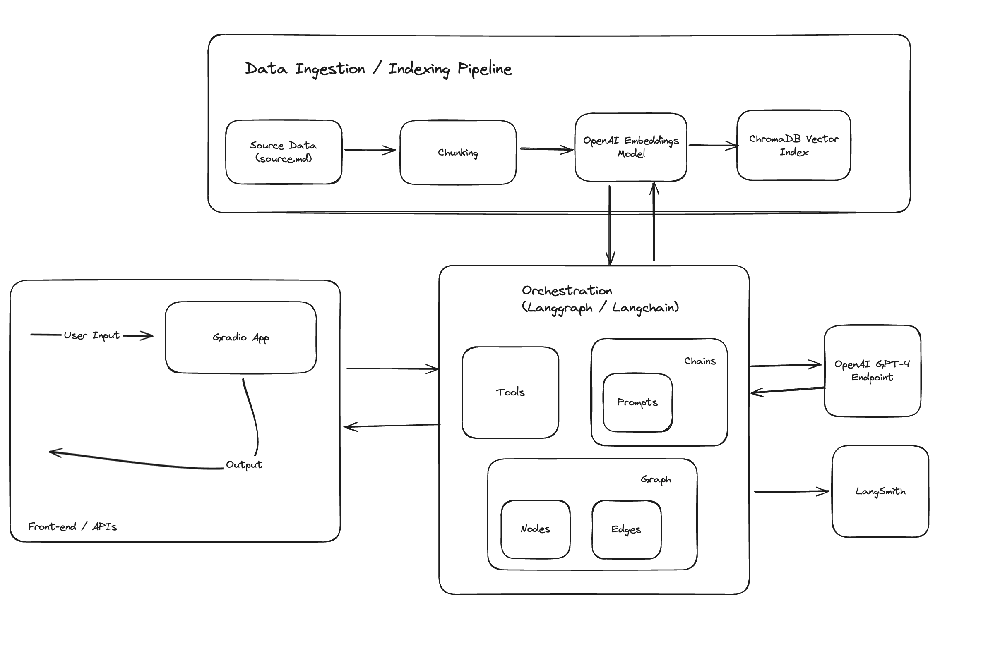
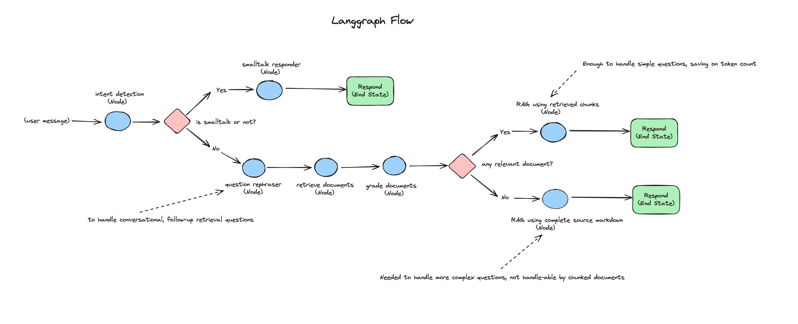

# Hello Sajal! 👋

## Overview

This project is designed to showcase a comprehensive chatbot application that leverages OpenAI's GPT-4 model, along with the latest capabilities of Langchain, including Langchain Expression Language and LangGraph, integrated with a Gradio interface for easy interaction. 

It's encapsulated in a Docker container for ease of deployment and scalability.


## Getting Started

### Building the Docker Container

1. Clone the repository to your local machine:
```
git clone <repository-link>
cd <repository-name>
```

2. Build the Docker image from the Dockerfile provided in the project:
```
docker build -t hello-sajal-app .
```

This command builds a Docker image named hello-sajal-app based on the instructions in the Dockerfile.

3. Running the Application

After building the image, you can run the application using the following command:
```
docker run -p 7860:7860 gradio-openai-app
```

This command runs the container and maps port 7860 of the container to port 7860 on your host, allowing you to access the Gradio application through your web browser.

4. Accessing the Application
Once the Docker container is running, open a web browser and navigate to http://localhost:7860 to interact with the Gradio application.

## Under the Hood
Both the docker container, and gradio app follow the flow:
1. src/ingest_data.py: Data extraction and ingestion into a ChromaDB vector database, which is persisted as on disk.
2. src/app.py: Initialization of the gradio app, driven by langchain for orchestration.

### Directories and Files
* Data: 
  * source.md: source of the information about Sajal Sharma in markdown format.
  * chroma_db: persist directory for chromadb.
* src: 
  * app.py: entrypoint for the app, code for gradio app.
  * graph.py: code for the langgraph orchestration graph.
  * ingest_data.py: code for data extraction, transformation and ingestion.
  * retriever.py: code for search over the ChromaDb vector index.
  * chains/*.py: custom and out of the box langchain chains for specific LLM functionalities.

### Components
* ChromaDB for indexing and searching chunked documents.
* Langchain for flow engineering.
* OpenAI models for executing LLM calls.
* Gradio for basic chat frontend.
* Langsmith for prompt tracing.

### GenAI App Features & Architecture

The application heavily utilizes langchain for prompts, chains, tools, LLM function calling and flow engineering, demonstrating some of the advanced use cases.

High level architecture:



Each incoming message from the user goes through modules for intent recognition, RAG, corrective RAG, and smalltalk chain.

The following diagram represents the flow of each incoming user message to the chat app:



